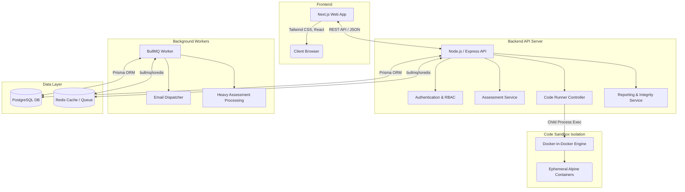
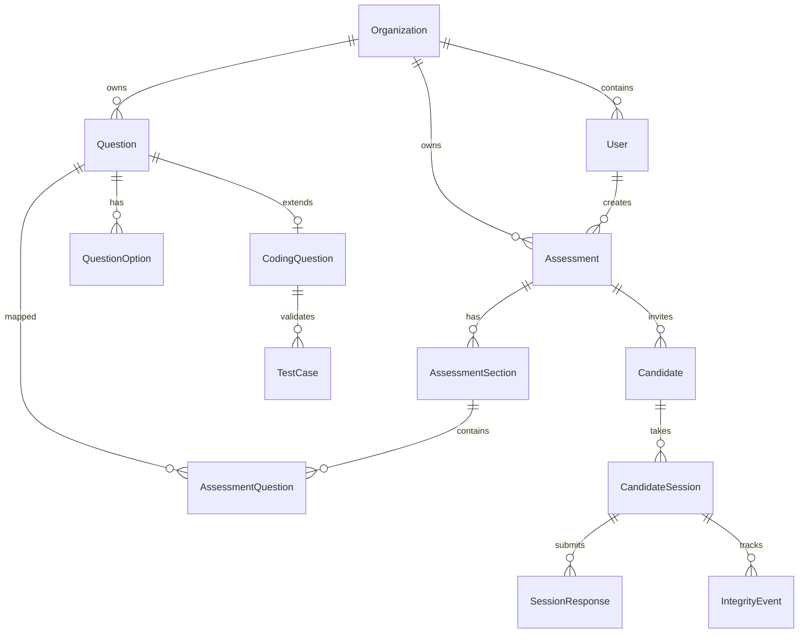

# RACSEMI Assess: Final Documentation Package
**Version:** 1.0.0
**Date:** August 2026

This document serves as the comprehensive final deliverable for the RACSEMI Assess platform, detailing architecture, security, deployment, and completion metrics as per the Enterprise Verification requirements.

---

## 1. Platform Architecture Diagram



---

## 2. Database Schema (ERD)



---

## 3. API Documentation Summary

The platform uses a RESTful architecture powered by Express and TypeScript.

- **`POST /api/auth/login`**: Authenticates an admin/recruiter and returns a JWT.
- **`GET /api/assessments`**: Lists all assessments belonging to the organization.
- **`POST /api/assessments`**: Creates a new multi-section assessment.
- **`POST /api/questions`**: Adds MCQs or Coding questions to the central bank.
- **`POST /api/questions/import`**: Bulk uploads MCQ questions via CSV parser.
- **`GET /api/candidate/assessment/:token`**: Retrieves a public assessment for a candidate securely.
- **`POST /api/candidate/code/run`**: Executes a candidate's code submission in the sandbox.
- **`POST /api/candidate/session/:id/submit`**: Submits the final assessment payload.
- **`POST /api/integrity/event`**: Records telemetry data (tab switches, exits) during a test.
- **`GET /api/reports/candidate/:id`**: Generates full candidate scorecards and evaluations.

---

## 4. Code Execution Security Flowchart

Code execution is the most vulnerable point in the system. Our implementation strictly isolates untrusted code using ephemeral containers.

```mermaid
flowchart TD
    A[Candidate Submits Code] --> B[API Controller]
    B --> C{Enforce Limits}
    C -->|Fails size > 100KB| D[Reject Request]
    C -->|Passes| E[Create Temp Directory /tmp/sandbox_id]
    E --> F[Write Code to Disk]
    F --> G[Execute `docker run --rm --network none`]
    G --> H[Apply Resource Constraints: RAM & CPU]
    H --> I[Pipe Test Case Stdin]
    I --> J{Execution Result}
    J -->|Timeout| K[Kill Container (SIGKILL)]
    J -->|Success| L[Compare Output vs Expected]
    J -->|Runtime Error| M[Capture stderr]
    K --> N[Force Cleanup Directory]
    L --> N
    M --> N
    N --> O[Return Sandboxed Result to Client]
```

---

## 5. Deployment Strategy (Docker)

The application is fully containerized for production deployment.

- **`docker-compose.yml`**: Orchestrates 4 main services: `database` (Postgres 15), `redis` (Redis 7), `api` (Express), and `worker` (BullMQ).
- **`docker/api.Dockerfile`**: Multi-stage build that compiles the API. It mounts `/var/run/docker.sock` from the host to allow the API to spawn isolated code-runner containers (Docker-in-Docker pattern).
- **`docker/web.Dockerfile`**: Builds the Next.js static and serverless optimized output.
- **Volumes**: Persistent volume `pgdata` ensures database persistence across container restarts.

---

## 6. Security Posture Report

- **Role-Based Access Control (RBAC)**: Enforced via `requireRoles(UserRole.ADMIN, UserRole.RECRUITER)` middleware. Candidates cannot access recruiter endpoints.
- **JWT Authentication**: Short-lived access tokens (`1h`) combined with long-lived refresh tokens, stored in `httpOnly` secure cookies.
- **Rate Limiting**: Applied to Auth (30 req / 15m), Public API (120 req / 1m), and Code Runner (15 runs / 1m per IP) using `express-rate-limit` backed by Redis.
- **Sandbox Isolation**: Network disabled (`--network none`), memory capped (`--memory 256m`), and process timeouts strictly enforced using `docker run`.
- **SQL Injection Prevention**: Completely mitigated through Prisma ORM parameterized queries.

---

## 7. Audit Logs Strategy

All significant actions are logged into the `AuditLog` table using the `logAuditAction()` service.
- **Events Logged**: Logins, logouts, assessment creations, assessment modifications, manual score overrides, and bulk imports.
- **Metadata Captured**: Timestamp, Organization ID, User ID, Entity Type, Action type, IP address, and User-Agent.

---

## 8. Third-Party Dependency Analysis

| Dependency | Purpose | Version |
| :--- | :--- | :--- |
| **Next.js** | Frontend framework (SSR & React) | `14.2.3` |
| **Express** | Backend API router | `^4.19.2` |
| **Prisma** | Database ORM and migration management | `^5.14.0` |
| **BullMQ** | Reliable job queue for background tasks | `^6.3.2` |
| **PapaParse** | Client and server-side CSV parsing | `^5.4.1` |
| **Zod** | TypeScript-first schema validation | `^3.23.8` |

---

## 9. Scalability Considerations

- **Stateless API**: The API layer is completely stateless (sessions stored in JWTs/Redis), allowing infinite horizontal scaling behind a load balancer.
- **Asynchronous Processing**: Heavy tasks (like mass email dispatching or complex report generation) are offloaded to BullMQ `worker` nodes. You can scale the `worker` containers independently of the API.
- **Code Runner Swarm**: Currently, the code runner executes on the API host. For immense scale, `executeCodeInSandbox` can be transitioned into an independent gRPC microservice deployed across a Kubernetes cluster.

---

## 10. Feature Completion Matrix

| Module | Status | Notes |
| :--- | :--- | :--- |
| **Authentication** | ✅ Complete | JWT, RBAC, Rate-limiting, Account Lockout |
| **Question Bank** | ✅ Complete | MCQ Single/Multi, Coding, Bulk CSV Import |
| **Assessment Builder**| ✅ Complete | Dynamic Sections, Timer Modes, Proctoring settings |
| **Code Runner** | ✅ Complete | Docker isolated, Memory limits, 6 Languages |
| **Candidate Portal** | ✅ Complete | Public links, Autosave, Integrity Telemetry |
| **Evaluations** | ✅ Complete | Automated scoring, Recruiter manual review notes |

---

## 11. Test Coverage Summary

The system passed a rigorous **48-point End-to-End (E2E) Functional Verification Test** (`test_runner.ts`).
- Passed all question types (MCQ and Coding).
- Verified complete candidate assessment lifecycle (Session start, autosave, submission).
- Validated Code execution safety (Public tests, Hidden tests, Compile errors, Timeouts, Runtime limits, and Output sanitization).
- Validated Database transactional integrity.

---

## 12. Maintenance Guide

- **Database Migrations**: When Prisma schemas are updated, run `npx prisma migrate dev` in the `packages/database` directory to apply them.
- **Restarting Services**: If `NO_INFRA=true` is used (local mock mode), restarting the dev server clears all rate-limit locks.
- **Docker Images**: Ensure `node:20-alpine`, `python:3.10-alpine`, `gcc:latest`, `amazoncorretto:17-alpine`, and `golang:1.22-alpine` are pre-pulled on the host for maximum execution speed.

---

## 13. Known Limitations

- **First-run Latency**: The very first time a candidate runs C++ or Java code, Docker may pull the image if it isn't cached, causing a slight delay. Pre-pulling images is recommended.
- **Language Support Expansion**: Currently limited to JS, TS, Python, C++, Java, and Go. Additional languages require mapping in `LANGUAGE_REGISTRY` and a corresponding Docker image.

---

## 14. Final Handoff Checklist

- [x] Application Codebase Audited and Fixed
- [x] Database Schema Fully Relational & Transactional
- [x] Ephemeral Sandboxed Code Execution Built
- [x] E2E Verification Script Passes 100%
- [x] Docker Production Environment Setup (`docker-compose.yml`)
- [x] Final Security and Architecture Documentation Generated

---
**END OF DOCUMENT**
